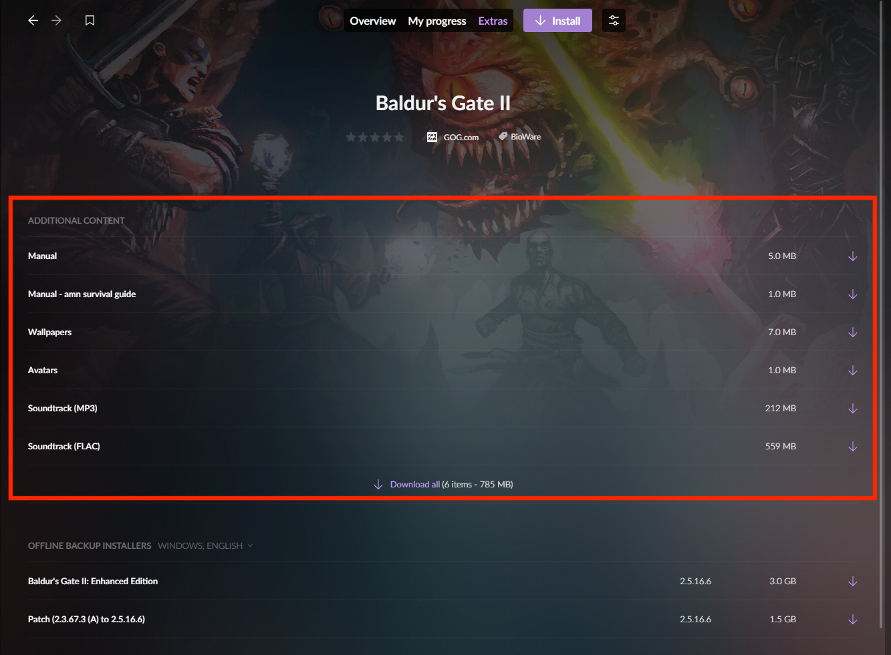

# DLCs, Extras & Demos

After receiving a request from you for setting up a downloadable content (DLC) or multiple DLCs for your game, your Product Manager may ask you if the DLC is in-game or if it consists of additional content such as an artbook or soundtrack.

!!! Tip
    Please note that, unlike Steam, you don’t have to include additional bonus content (soundtracks, wallpapers, etc.) in the build that is uploaded to the pipeline. Moreover, **this content can be a standalone product** to be sold separately and independently from any of your games.
    
    Please send the additional content to your Product Manager, so that they can handle the packaging and distribution thereof.

## In-game DLC

This is simply the content that appears within the game (in-game items and other content). Please see the screenshot below to see how in-game DLC is displayed in the Galaxy client. Such DLCs should be handled using the [DLC Discovery](sdk-dlc-discovery.md) method.

## Extras

This includes items such as artbooks, soundtracks, wallpapers, avatars, etc. Please check the screenshots below to see how bonus content is displayed on the game page and in the GOG GALAXY client, when a game is in a user’s account:

## Demo

If you want to have a Demo of your game available on GOG, we need to set up a separate SKU for that. Please contact your Product Manager for the product ID. You will later need to upload the demo build the same way you uploaded the main game.
